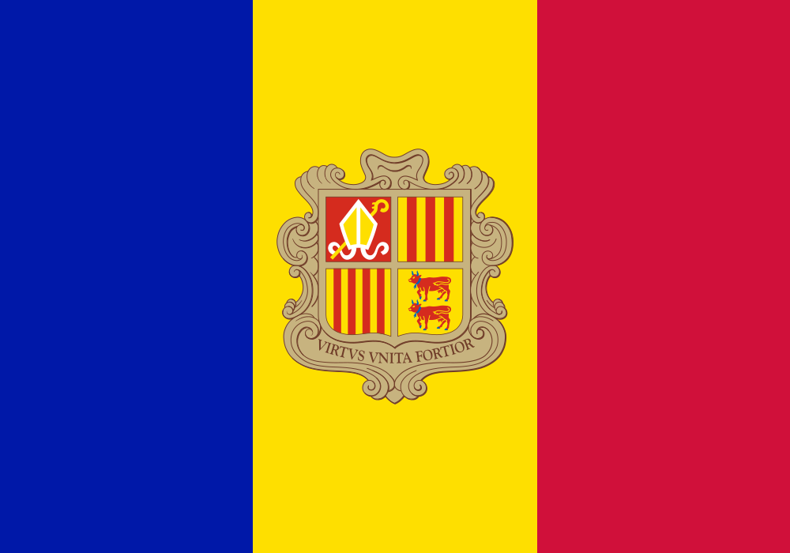
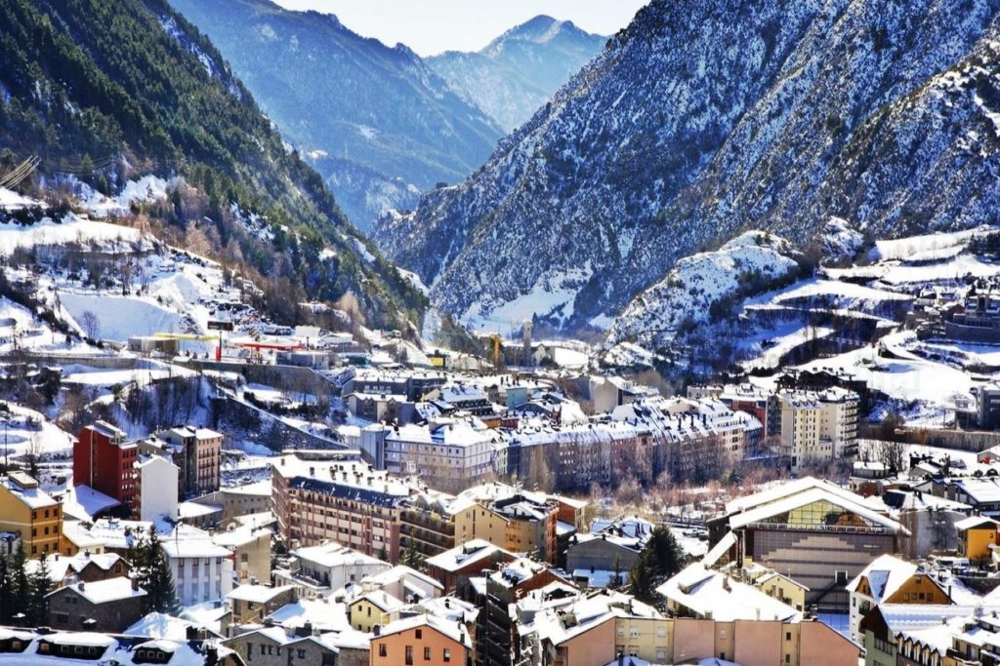

Andorra

Prime Minister: Antoni Martí Petit (2011)

Chiefs of State (Coprinces): Francois Hollande for France and Joan Enric Vives Sicília for Spain

Population (2014 est.): 85,458 (growth rate: 0.17%); birth rate: 8.48/1000; infant mortality rate: 3.69/1000; life expectancy: 82.65

Capital and largest city (2011 est.): Andorra la Vella, 23,000

Monetary units: Euro

National name: Principat d'Andorra

Current government officials

Languages: Catalán (official), French, Castilian, Portuguese

Ethnicity/race: Spanish 43%, Andorran 33%, Portuguese 11%, French 7%, other 6% (1998)

National Holiday: Our Lady of Meritxell Day, September 8

Literacy rate: 100%

Economic summary: GDP/PPP (2012): $3.163 billion; per capita $37,200. Real growth rate: -1.6%. Inflation: 1.1%. Unemployment: 4% (2012 est.). Arable land: 5.32%. Agriculture: small quantities of rye, wheat, barley, oats, vegetables; sheep. Labor force: 36,060 (2012); agriculture 0.4% industry 4.7%, services 94.9%. Industries: tourism (particularly skiing), cattle raising, timber, banking. Natural resources: hydropower, mineral water, timber, iron ore, lead. Exports: $70 million f.o.b. (2011): tobacco products, furniture. Imports: $1.43 billion (2011): consumer goods, food, electricity. Major trading partners: Spain, France

Communications: Telephones: main lines in use: 39,000 (2012); mobile cellular: 65,000 (2012). Broadcast media: 1 public TV station and 2 public radio stations; about 10 commercial radio stations; good reception of radio and TV broadcasts from stations in France and Spain; upgraded to terrestrial digital TV broadcasting in 2007; roughly 25 international TV channels available (2012). Internet hosts: 28,383 (2012). Internet users: 67,100 (2009).

Geography: Andorra is nestled high in the Pyrénées Mountains on the French-Spanish border.

Government: A parliamentary coprincipality composed of the bishop of Urgel (Spain) and the president of France. Their representatives are listed above. The principality was internationally recognized as a sovereign state in 1993.

History: An autonomous and semi-independent coprincipality, Andorra has been under the joint suzerainty of the French state and the Spanish bishops of Urgel since 1278. It maintains closer ties to Spain, however, and Catalán is its official language. In the late 20th century, Andorra became a popular tourist and winter sports destination and a wealthy international commercial center because of its banking facilities, low taxes, and lack of customs duties. In 1990 Andorra approved a customs union treaty with the EU permitting free movement of industrial goods between the two, but with Andorra applying the EU's external tariffs to third countries. Andorra became a member of the UN in 1993 and a member of the Council of Europe in 1994. In 2002, Andorra shut down an incinerator that was emitting 1,000 times the dioxin levels permitted by the EU.

On June 3, 2009, Jaume Bartumeu was elected the new head of government with 14 votes in the the 28-seat Parliament.

